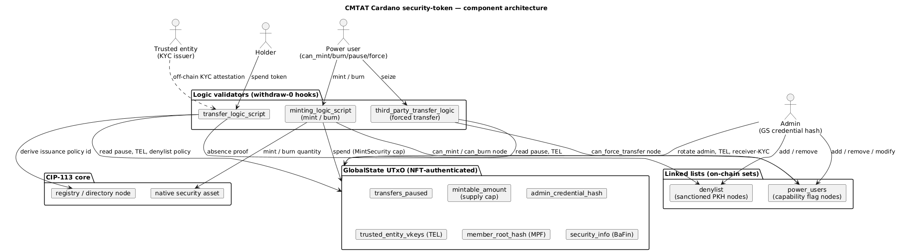
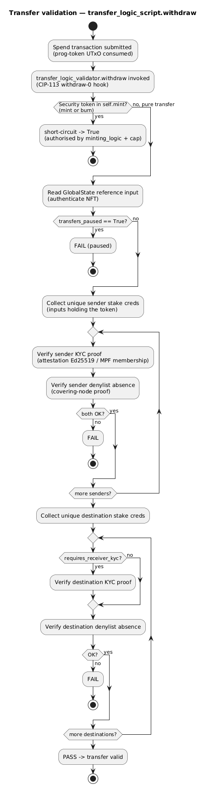
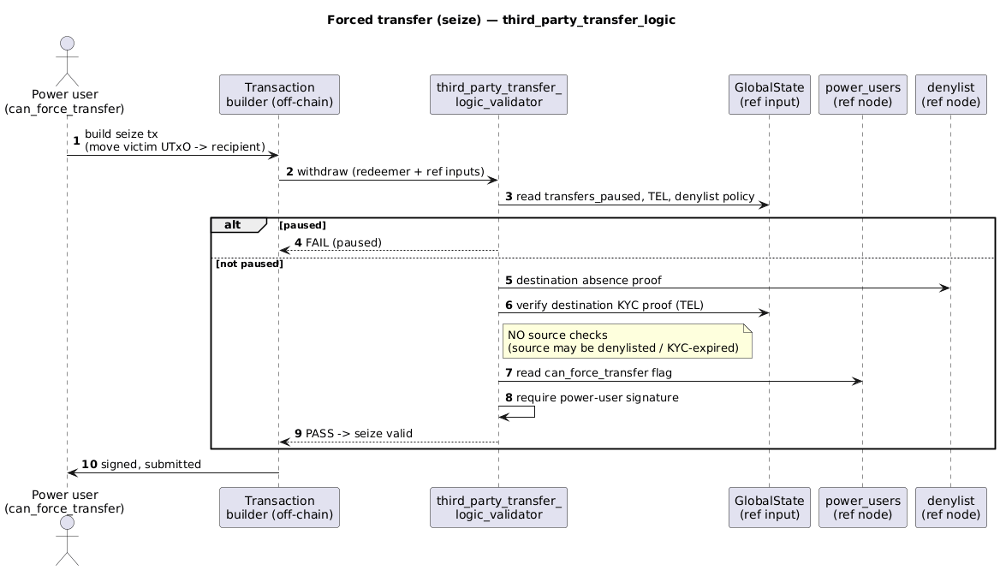
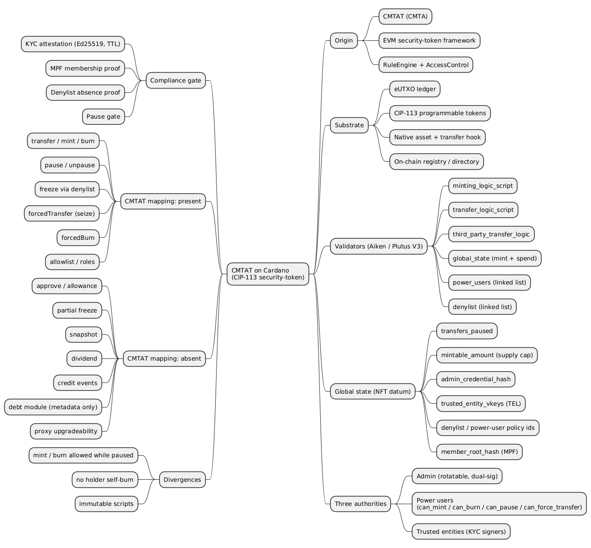

The CMTAT standard was written for EVM chains, where a token is a contract with methods and a role registry. Cardano offers neither: it settles value with unspent outputs and immutable scripts. This article describes how the Cardano Foundation's CIP-113 **security-token** substandard reconstructs the CMTAT feature set on that different substrate, which parts map cleanly, and where the two models diverge.

> This article has been made with the help of [Claude Code](https://claude.com/product/claude-code) and several custom skills

[TOC]

## Background: what CMTAT provides

[CMTAT](https://github.com/CMTA/CMTAT) (CMTA Token) is a security-token framework maintained by the Capital Markets and Technology Association for tokenizing regulated financial instruments on EVM-compatible chains. It is a modular Solidity codebase: an ERC-20 core is composed with pause, enforcement (freeze and forced transfer), validation, snapshot, document, debt, and access-control modules, and transfer rules are delegated to an external `RuleEngine`. Authorization uses OpenZeppelin role-based access control with granular roles such as `MINTER_ROLE`, `BURNER_ROLE`, `PAUSER_ROLE`, and `ENFORCER_ROLE`.

The reference against which this port is measured is the [CMTAT Equivalency Assessment](https://github.com/CMTA/CMTAT-equivalency-assessment), a checklist that CMTA publishes so that a non-Solidity implementation can be evaluated function by function: token attributes, the token module, pause, enforcement, transfer restrictions, access control, and the optional snapshot, dividend, credit-event, and debt modules.

## The Cardano substrate: eUTXO and CIP-113

Cardano uses the **extended UTXO (eUTXO)** ledger. A token is not an account balance held by a contract; it is a quantity of a **native asset** distributed across unspent outputs. Spending an output runs a validator script that returns a boolean over the whole transaction, and validator scripts are immutable once deployed. There is no `msg.sender`, no storage a contract mutates in place, and no upgradeable proxy.

[CIP-113](https://github.com/cardano-foundation/CIPs/pull/444) (Programmable Tokens, which supersedes CIP-143) makes native assets programmable. A programmable token carries an obligation: every mint, burn, or transfer must satisfy an associated **transfer-logic script** invoked through the withdraw-zero pattern, in which a stake validator runs as a side effect of a zero-value withdrawal so that it observes the entire transaction. That transfer-logic hook is the CIP-113 counterpart of the CMTAT `RuleEngine`. An on-chain registry (directory) records, for each programmable-token policy, the script hashes that govern it, and the substandard derives the token's issuance policy id from that registry node at runtime.

The implementation under review lives in the [CIP-113 programmable-tokens platform](https://github.com/cardano-foundation/cip113-programmable-tokens-platform) repository, under `src/substandards/security-token/`. It is written in [Aiken](https://aiken-lang.org/) (compiler `v1.1.21`, Plutus V3) and is a port of the `fn-bafin-cardano-sc` codebase (hosted under FluidTokens, and named `easy1staking-com/fn-bafin-cardano-sc` in the substandard's own `aiken.toml`) targeting German BaFin and Swiss regulated-securities requirements. The platform ships other substandards (a minimal `dummy`, a `freeze-and-seize` stablecoin denylist, and two `kyc` variants); `security-token` is the one that maps onto CMTAT.

## Architecture of the security-token substandard

The substandard replaces one contract-with-methods by a set of cooperating validators, a single piece of authenticated global state, and two on-chain sets held as linked lists.

The six validators are:

- `minting_logic_script`: authorizes mint and burn.
- `transfer_logic_script`: the per-transfer compliance hook.
- `third_party_transfer_logic_script`: the forced-transfer (seize) path.
- `global_state`: a mint validator that bootstraps the state NFT and a spend validator that governs every state change.
- `power_users`: a linked list of operator nodes carrying capability flags.
- `denylist`: a linked list of sanctioned key hashes.

**Global state.** A single NFT authenticates one `GlobalState` UTxO whose inline datum, `GlobalStateDatum`, holds the mutable protocol configuration: `transfers_paused`, `mintable_amount` (a remaining-supply counter), `admin_credential_hash`, the policy ids of the power-user and denylist lists, the trusted-entity KYC key list (`trusted_entity_vkeys`), a Merkle-Patricia-Forestry membership root (`member_root_hash`), a `requires_receiver_kyc` flag, and an opaque `security_info` blob carrying BaFin disclosure fields. A structural invariant keeps `transfers_paused` at field index 0 so the transfer validators can read the pause flag through raw UPLC builtins without deserializing the whole datum. Every spend of the state UTxO must preserve its address, its NFT, and its ada value, and every branch except the mint branch rejects any concurrent security-token mint, which is what makes `mintable_amount` a binding supply cap.

**Linked lists.** Cardano has no mapping type, so both the operator set and the sanctions set are ordered on-chain linked lists built with the Anastasia Labs design-pattern library. Each list uses a nonce-gated `Init`, an admin-gated `Deinit`, and admin-gated insert and remove operations that maintain ascending key order.

### Three authorities instead of one role registry

CMTAT concentrates permissions in a single OpenZeppelin `AccessControl` registry. The Cardano port decomposes authorization into three separable authorities, because the eUTXO model expresses each one differently.

1. **Admin.** One 28-byte `admin_credential_hash` stored in the state datum. It gates every list mutation: adding or removing power users, adding or removing denylist entries, editing the trusted-entity list, updating the membership root, toggling receiver-KYC, and rewriting `security_info`. The admin is rotatable through the `RotateAdmin` action, which requires a dual signature from both the outgoing and incoming key so that a handover cannot silently take over the token and a lost key cannot soft-brick it.
2. **Power users.** Nodes in the `power_users` list, each a `PowerUser` record with independent boolean flags `is_admin`, `can_mint`, `can_burn`, `can_pause`, and `can_force_transfer`. A privileged operation checks the relevant flag on a referenced node and requires that node's signature on the transaction.
3. **Trusted entities.** Ed25519 verification keys in `trusted_entity_vkeys`. These are KYC issuers who sign attestations off-chain; they never submit transactions themselves. The admin curates the list; the transfer validators verify their signatures.

The helper that checks a signature accepts either a transaction signatory key hash or a matching script withdrawal, so any of these authorities can be a native multisig or a governance script rather than a single key.

## The compliance gate: how a transfer is validated

The compliance hook proper is `transfer_logic_script.withdraw`, which CIP-113 runs on every spend of the programmable token. Its structure is shown below.

The validator first derives the token's issuance policy id from the registry reference input, then detects whether the transaction is a mint or burn by inspecting `self.mint`. Mints and burns short-circuit to `True`: they carry no transfer semantics and are authorized entirely by `minting_logic_script` and the supply cap, so requiring a KYC proof there would be meaningless. A pure transfer falls through to the strict path.

For a genuine transfer the validator reads the state reference input and rejects the transaction if `transfers_paused` is set. It then aggregates the unique sender stake credentials across inputs that carry the token, and for each one checks two conditions: a valid KYC proof, and denylist absence. Destinations are checked the same way, except that the KYC proof is required only when `requires_receiver_kyc` is enabled, while denylist absence is always required on both sides.

**KYC proofs.** A proof comes in two shapes. An **attestation** is a 66-byte payload signed by a trusted entity, binding the user's key hash, a KYC tier, a `valid_until` timestamp, the security's policy id, and a network identifier, verified with `verify_ed25519_signature` against a key present in `trusted_entity_vkeys`. The time-to-live is checked against the transaction's validity upper bound, and the network byte prevents an attestation minted for one network from being replayed on another. A **membership** proof instead demonstrates inclusion of the user's key hash in the Merkle-Patricia-Forestry tree committed by `member_root_hash`. The two mechanisms give the issuer a choice between short-lived signed credentials and an on-chain allowlist.

**Denylist absence.** Because the denylist is an ordered linked list, absence is proven in constant time with a covering node: a reference input whose key is strictly below the target and whose forward link is either strictly above the target or the tail sentinel witnesses that the target cannot be present between them. A denylisted key hash can therefore neither send nor receive the token, which is stronger than the send-side freeze CMTAT enforces by default.

## Minting, burning, and the supply cap

`minting_logic_script.withdraw` authorizes issuance and redemption. A positive minted quantity requires a referenced power-user node with `can_mint` set and that node's signature; a negative quantity requires `can_burn`. In the same transaction the state UTxO is spent through its `MintSecurity` branch, which recomputes `mintable_amount` minus the minted quantity and rejects the transaction if the result is negative. Since every non-mint branch of the state validator forbids a concurrent security mint, the only way to create supply is through this capped path.

Two consequences follow that a CMTAT reader should note. First, there is **no holder self-burn**: every burn is an operator action gated by `can_burn`, matching the CMTA legal position that only the issuer may cancel a security. Second, because mint and burn short-circuit the transfer hook, they bypass both the pause flag and the denylist: issuance and redemption stay **available while the token is paused**, and neither is denylist-screened at the hook. CMTAT draws that line more tightly. Its mint and burn also skip the pause check, but they still enforce the frozen and deactivation checks (see the FAQ), so a frozen holder cannot be minted to or burned from through the ordinary path. A forced transfer, by contrast, does respect the pause flag.

## Enforcement: pause, freeze, and forced operations

The port covers all four CMTAT enforcement primitives, each expressed through the mechanism the ledger makes natural.

**Pause** is a boolean in the state datum. The `PauseTransfers` action requires a power user with `can_pause` and that user's signature, and both transfer validators consult the flag on every spend.

**Freeze** is the denylist. `AddToDenylist` and `RemoveFromDenylist` are admin-signed insert and remove operations on the sanctions list. This is the two-function form the CMTAT guideline permits for non-EVM chains, rather than the single `setAddressFrozen` toggle.

**Forced transfer** is `third_party_transfer_logic_script`, the seize path shown below.

A seize is deliberately asymmetric. It performs no checks on the source, so an operator can move tokens out of a wallet whose owner is sanctioned or whose KYC has lapsed, which is the point of a regulatory recovery. It still requires that each destination be KYC-verified and denylist-absent, respects the pause flag, and requires a power user with `can_force_transfer`. Because a seize produces a destination output, it never burns.

**Forced burn** is the `can_burn` negative-mint path already described. The port therefore implements both forced primitives and follows the CMTAT recommendation that only forced burn cancels tokens while forced transfer moves them, a split CMTAT Solidity omits to save contract size.

## Equivalency mapping against CMTAT

The table condenses the function-by-function assessment. "Present" means the capability exists on-chain in the substandard; "metadata only" means a field records the value without any validator enforcing it.

| CMTAT capability | Status on Cardano | Mechanism |
|---|---|---|
| Transfer | present | `transfer_logic_script` (KYC + denylist + pause) |
| Mint / burn | present | `minting_logic_script`, capped by `mintable_amount` |
| Approve / allowance | absent | no allowance model in eUTXO |
| Pause / unpause | present | `transfers_paused`, `can_pause` power user |
| Deactivate contract | partial | indefinite pause or list `Deinit`; no permanent kill-switch |
| Freeze / unfreeze | present | admin-gated denylist (blocks send and receive) |
| Forced transfer | present | `third_party_transfer_logic_script`, `can_force_transfer` |
| Forced burn | present | `can_burn` negative mint |
| Partial freeze | absent | denylist is address-level, all-or-nothing |
| Conditional transfer workflow | implicit | off-chain KYC attestation acts as pre-approval |
| Allowlist / KYC | present | trusted-entity attestations plus MPF membership tree |
| Grant / revoke role | present | admin edits the power-user and trusted-entity lists |
| Snapshot | absent | none on-chain |
| Dividend | absent | not implemented |
| Credit events | absent | not modeled |
| Debt module | metadata only | equity `security_info` fields, non-enforcing |
| Upgradeability | partial | immutable scripts, mutable datum, registry re-pointing |
| Gasless (ERC-2771) | absent | fee sponsorship handled off-chain |

Token attributes map indirectly. Cardano native assets carry no on-chain `name`, `symbol`, or `decimals`; the asset name is a validator parameter, human-readable metadata lives in `security_info` or in an off-chain token registry, and the ledger's integer-only quantities satisfy the CMTAT "no fractions" requirement by construction. Total supply and balances are not view functions but ledger facts recovered from a chain indexer, while `mintable_amount` records the remaining issuance headroom on-chain.

## Divergences and design tradeoffs

The port is faithful on the enforcement surface but differs from CMTAT in ways that follow from the ledger rather than from choice.

Authorization is capability-based rather than a single role registry, and identity is a key hash or script hash rather than an account with a role bitmap. The KYC layer is attestation-based: a transfer presents a fresh signed credential or a membership proof at spend time, which keeps per-holder on-chain state small and supports tiered verification, at the cost of an off-chain issuer that must remain available to sign. In-place upgradeability has no equivalent: Plutus validators cannot be patched, so evolving the logic means deploying new scripts and re-pointing the registry, while the parts CMTAT would change through an upgrade (roles, issuers, pause, sanctions) are instead mutable datum fields governed by the state validator. The debt, snapshot, dividend, and credit-event modules are out of scope for this equity-oriented substandard; the `security_info` block records disclosure fields but no validator acts on them.

A practical caution: the platform's own authors label it research-and-development, not production-ready, and pending a professional security audit. The mapping in this article is functional, not a security or legal opinion.

## Conclusion

The CIP-113 security-token substandard reproduces the CMTAT enforcement model on a ledger that shares none of CMTAT's primitives. Transfers pass through a mandatory compliance hook, issuance and redemption are operator-gated and supply-capped, and pause, freeze, forced transfer, and forced burn are all present with a role model split across an admin key, capability-flagged power users, and off-chain KYC issuers. The gaps against the full CMTAT checklist (allowance, partial freeze, snapshots, dividends, credit events, a debt module, and in-place upgradeability) reflect the eUTXO model and the substandard's equity scope rather than an incomplete port. The mindmap below summarizes the structure, the authorities, the compliance gate, and the equivalency result.

## Annex — Key Terms

| Term | Definition |
|------|------------|
| **CMTAT** | The CMTA Token security-token framework for tokenizing regulated financial instruments, originally a modular Solidity codebase for EVM chains. |
| **CIP-113** | The Cardano proposal for programmable tokens, which attaches a mandatory validation hook to native-asset mints, burns, and transfers. |
| **eUTXO** | Cardano's extended unspent-transaction-output ledger, where value is held in outputs and spending runs a validator over the whole transaction. |
| **Substandard** | A pluggable rule set that defines how one class of CIP-113 programmable token behaves on top of the shared core framework. |
| **Withdraw-zero hook** | The pattern of running a stake validator through a zero-value withdrawal so that it observes and gates the entire transaction. |
| **GlobalState UTxO** | The single NFT-authenticated output whose inline datum holds the token's mutable configuration: pause flag, supply cap, admin, KYC issuers, and sanctions policy. |
| **Power user** | A node in the on-chain operator list carrying independent capability flags (`can_mint`, `can_burn`, `can_pause`, `can_force_transfer`). |
| **Trusted entity** | A KYC issuer whose Ed25519 key is listed in the state datum and who signs off-chain attestations that transfers verify on-chain. |
| **Denylist absence proof** | A constant-time witness that a key hash is not in the sanctions linked list, using a covering node whose key and forward link bracket the target. |
| **Forced transfer (seize)** | An operator-authorized move of tokens that skips all source checks but still requires a KYC-verified, non-denylisted destination and respects pause. |

## Frequently Asked Questions

**Q: Why does the transfer validator skip its checks when a token is minted or burned, and how does that compare with CMTAT?**

On Cardano the transfer-logic hook gates movement of already-issued tokens between holders. A mint or burn has no sender-to-recipient semantics, so it is authorized elsewhere: `minting_logic_script` verifies the operator's `can_mint` or `can_burn` flag and signature, and the state validator's `MintSecurity` branch enforces the supply cap. The validator detects a non-zero security-token quantity in `self.mint` and short-circuits to `True`; a pure transfer never touches `self.mint` and falls through to the strict path. One consequence is that this short-circuit bypasses both the pause flag and the denylist, so on this port issuance and redemption are neither pausable nor denylist-screened at the compliance hook.

CMTAT draws the line differently. Its mint and burn run through `_canMintBurnByModuleAndRevert`, which calls `_requireNotDeactivated()` and reverts when `EnforcementModule.isFrozen(target)` holds, but it does not call `paused()`. Transfers run through `_canTransferGenericByModuleAndRevert`, which calls `_requireNotPaused()` and the frozen check but not the deactivation check. So CMTAT and this port agree that pause alone does not stop issuance or redemption, yet they differ on freezing: CMTAT still blocks minting to, or a standard burn from, a frozen address, whereas the Cardano port does not consult the denylist on the mint/burn path. On the port a frozen holder's tokens are instead moved or cancelled through the forced-transfer and forced-burn operators. CMTAT's permanent `deactivated()` state has no analog in the port, which offers only pause and list teardown.

**Q: How is address freezing represented without a mapping type?**

Cardano has no key-value map, so the sanctions set is an ordered on-chain linked list keyed by payment key hash. Freezing an address is an admin-signed `AddToDenylist` insert; unfreezing is a `RemoveFromDenylist`. At transfer time the validator does not scan the whole list; it verifies a single covering node, one whose key is strictly below the target and whose forward link is strictly above it (or is the tail), which proves in constant time that the target is absent. Presence of a node blocks the key hash from both sending and receiving.

This linked list stands in for the `mapping(address => bool)` a Solidity contract would use, which eUTXO cannot offer because it has no global mutable storage to hold such a map. One UTxO per entry buys cheap proofs (a transfer references a single covering node instead of loading the whole set) and keeps unrelated entries independent. The costs are ordering and locking: nodes must stay sorted for the absence proof to hold, each insert or remove rewrites its neighbour so admin mutations near the same point must be sequenced, an off-chain index is needed to locate the covering node, and every entry locks a small min-ada deposit. For the KYC allowlist the port instead uses a Merkle-Patricia-Forestry tree, which compresses the whole set to one 32-byte root at the cost of logarithmic-size proofs. Both are authenticated-dictionary encodings that substitute for the mapping the ledger does not provide.

**Q: What are the three authorities, and why not a single role registry like CMTAT?**

The admin is a rotatable key hash in the state datum that governs every list mutation. Power users are nodes in an operator list with per-capability flags for mint, burn, pause, and forced transfer. Trusted entities are off-chain KYC issuers whose signing keys are curated in the state datum. The split exists because eUTXO expresses each authority differently: list governance is a datum-gated spend, an operation permission is a flag on a referenced node plus a signature, and KYC is a signature verified against a listed key. A single OpenZeppelin-style registry has no direct eUTXO equivalent.

**Q: A token is paused. Can an operator still mint new units or burn existing ones?**

Yes. Mint and burn short-circuit the transfer hook and the state validator's `MintSecurity` branch does not read the pause flag, so issuance and redemption remain available while transfers are frozen. A forced transfer, however, runs `third_party_transfer_logic_script`, which does check the pause flag and is therefore blocked while the token is paused. This asymmetry differs from a naive reading of CMTAT and is worth flagging to issuers.

**Q: Combine two mechanisms: how does a seize move tokens out of a sanctioned wallet even though that wallet is on the denylist?**

A regular transfer checks denylist absence for both sender and recipient, so a sanctioned wallet cannot send. The seize path is a separate validator, `third_party_transfer_logic_script`, that deliberately performs no checks on the source. It requires only that each destination be KYC-verified and denylist-absent, that the transaction respect the pause flag, and that a power user with `can_force_transfer` sign. Because the tokens live at a programmable-token script address whose spending is governed by the transfer logic rather than by the holder's signature alone, the operator can consume the sanctioned wallet's output without that holder's consent. The result is a recovery transfer that a plain transfer could never perform.

**Q: If Plutus scripts are immutable, how can the token be governed or corrected over time?**

The logic itself cannot be patched: changing a validator means deploying a new script and re-pointing the CIP-113 registry node at it. What CMTAT would ordinarily change through a proxy upgrade, roles, KYC issuers, the pause state, the sanctions set, and the supply cap, is instead held in the mutable `GlobalStateDatum` and edited through the governed spend of the state UTxO. The admin key that authorizes those edits is itself rotatable through the dual-signature `RotateAdmin` action, so operational control can move without redeploying anything.

## References

### Specifications and standards

- [CIP-113 — Programmable Tokens (pull request)](https://github.com/cardano-foundation/CIPs/pull/444)
- [CIP-143 — Interoperable Programmable Tokens](https://cips.cardano.org/cip/CIP-0143)
- [ERC-3643 — T-REX permissioned tokens](https://eips.ethereum.org/EIPS/eip-3643)

### Implementations and references

- [CIP-113 programmable-tokens platform](https://github.com/cardano-foundation/cip113-programmable-tokens-platform)
- [CMTAT — CMTA Token framework](https://github.com/CMTA/CMTAT)
- [CMTAT Equivalency Assessment](https://github.com/CMTA/CMTAT-equivalency-assessment)

### Tooling and ecosystem

- [Aiken smart-contract language](https://aiken-lang.org/)
- [Anastasia Labs Aiken design patterns](https://github.com/Anastasia-Labs/aiken-design-patterns)
- [Cardano Developer Portal](https://developers.cardano.org/)
- [Claude Code](https://claude.com/product/claude-code)
