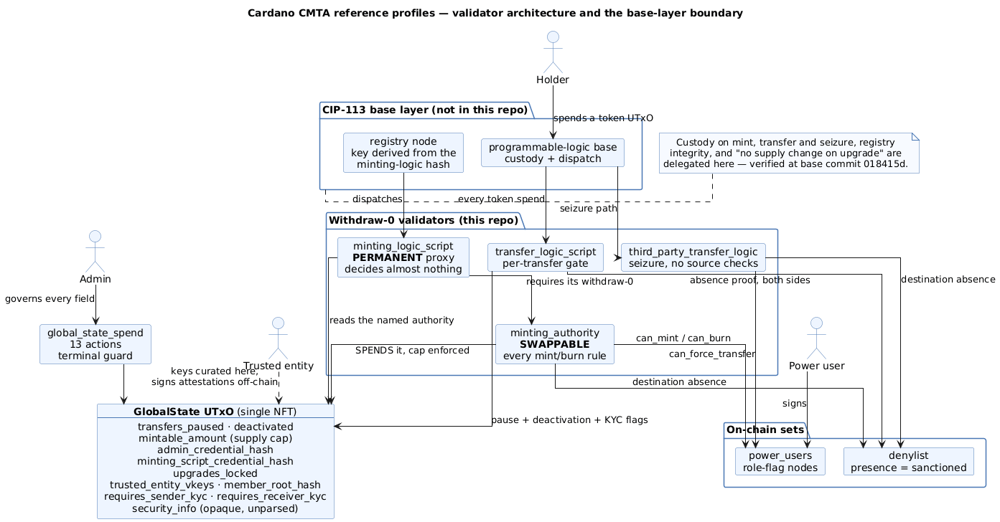
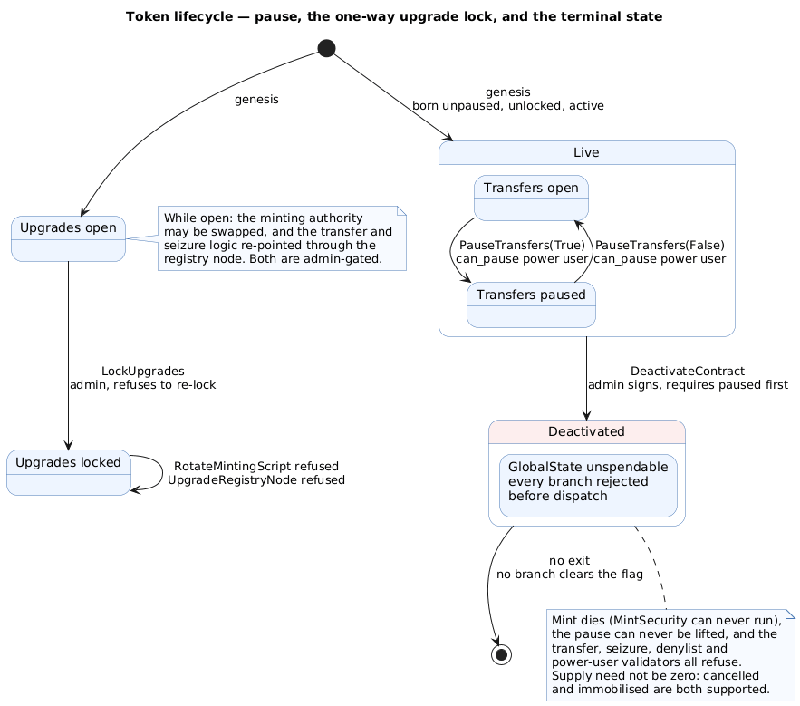

An earlier article in this project described how the Cardano Foundation's CIP-113 `security-token` substandard reconstructed the CMTAT feature set on an eUTXO ledger, and closed on three gaps that looked structural: no permanent deactivation, no upgrade path, and a burn that skipped the compliance gate entirely. A successor codebase, `cpt-rwa-ch-de-cmta-reference`, has since been published as a standalone repository. All three gaps are closed in it, and two of the three are closed by mechanisms with more to them than the feature list shows.

The repository ships two legal profiles over one set of validators: a German profile aligned with the *Gesetz über elektronische Wertpapiere* (eWpG), where the contracts act as the technical register layer under a duly authorised *registerführende Stelle*, and a Swiss profile aligned with the CMTA framework, whose 42 numbered functionalities `ABS-01` to `ABS-42` include only `ABS-01` to `ABS-14` as mandatory. What differs between the two profiles is the metadata schema and which behaviours are obligatory, not the code.

This article covers what changed since the substandard and why. Three mechanisms carry most of the change: the proxy-and-authority split that gives an immutable-script ledger a real upgrade path, the terminal deactivation state and the one-way lock that bounds it, and two behaviours that nobody wrote into either layer but that emerge from composing this deployment with the CIP-113 base layer.

> This article has been made with the help of [Claude Code](https://claude.com/product/claude-code) and several custom skills

[TOC]

## What the repository is

The contracts are [Aiken](https://aiken-lang.org/) (Plutus V3), compiled with `v1.1.23`, and they build on [CIP-113](https://github.com/HarmonicLabs/CIPs/blob/master/CIP-0113/README.md), the programmable-token proposal by Michele Nuzzi, Matteo Coppola, Giovanni Gargiulo and Philip Di Sarro. The primitives are the ones a permissioned security token needs: KYC-gated transfers, a sanctions denylist, a global pause, forced transfer and seizure, a supply cap, role-split operators, and an irreversible decommission switch.

Ten validators do the work, spread across seven source modules in two groups. The withdraw-zero group runs as a side effect of a zero-value withdrawal, which lets a stake validator observe an entire transaction: `minting_logic_script` (a proxy), `minting_authority` (the rules), `transfer_logic_script`, and `third_party_transfer_logic_script`. The state group governs on-chain data, and each of its three modules declares both a mint validator and a spend validator: `global_state` (a genesis mint, plus a spend validator with thirteen action branches), `power_users`, and `denylist`, the last two being ordered linked lists built on the Anastasia Labs design-pattern library.

Authorisation is split three ways, as it was in the substandard, but one of the three has changed. An **admin** credential hash in the state datum governs the power-user list, the trusted-entity list, the membership root, the security metadata, both KYC toggles, the upgrade actions and deactivation; it is rotatable through a dual-signature handover. **Power users** are nodes in a linked list carrying five independent flags: `is_admin`, `can_mint`, `can_burn`, `can_pause` and `can_force_transfer`. **Trusted entities** are up to 64 Ed25519 verification keys curated in the state datum whose holders sign KYC attestations off-chain and never submit a transaction.

The change is `is_admin`. In the substandard the flag existed in the datum but no validator consulted it, so sanctions were a master-admin operation. Here it is the authority that adds and removes denylist entries, deliberately split from the master key so that a compliance function can be delegated without handing over control of the protocol.

## A permanent proxy and a swappable authority

Cardano has no `delegatecall`, and a Plutus validator's compiled bytes are its address. The obstacle to upgrading a CIP-113 token is sharper than "scripts are immutable": a registry node's key is derived from the minting-logic script hash, and the token's issuance policy id is derived from that key. Change the minting logic and you have minted a different token, leaving every already-issued unit stranded under a policy nothing governs.

The repository's answer is to make the unchangeable thing as small as possible. `minting_logic_script.ak` is the script whose hash is frozen into the registry forever, and it decides four things and nothing else: that GlobalState is authentic (it carries the single state NFT), that the protocol is not `deactivated`, that the authority named in the datum is not this proxy itself, and that the named authority's withdraw-zero is present in the same transaction. That is the entire validator, and its own doc comment records that going through a shared helper rather than resolving the state inline was measured to move the compiled hash, which is why the duplication stays.

Every substantive rule lives instead in `minting_authority.ak`, which the admin can replace in place through the `RotateMintingScript` action. That action is deliberately single-signature, unlike the dual-signature admin rotation: an authority being replaced because it is buggy or compromised is exactly the case that must still work when the outgoing script can no longer be trusted to co-sign.

The proxy checking almost nothing is what makes the authority replaceable, and it is also the price. Five invariants are enforced in the authority or nowhere at all, and its header names them: no registry node may be spent during a mint or burn (otherwise a routine mint can carry a registry update that re-points the transfer logic at a permissive script, irreversibly); GlobalState must be spent, not merely referenced, so its `MintSecurity` branch decrements the cap; only the security asset name may be minted under the issuance policy; the protocol must not be deactivated; and a registration must name this deployment's proxy, forbid unfracking, pin this deployment's GlobalState, and mint that node's own registry NFT in the same transaction.

That last clause is load-bearing rather than cosmetic. Requiring merely that *some* registry NFT is minted would let an admin-signed transaction bundle a throwaway insert for an unrelated token to satisfy the check, while this token's existing node is spent and re-emitted through the base layer's update path with `transfer_logic_script` re-pointed. Scoping the mint to *this* node closes it, because on an insert the NFT is created now and on an update it is carried forward from the spent node.

One hazard is documented rather than fixed. The `minting_script_credential_hash` field is not validated against anything: pointing it at any other withdraw-capable script in the deployment silently disables every mint control, and pointing it at `transfer_logic_script` (whose withdraw-zero needs no signature at all) would let anyone mint up to the supply cap with no checks. The same applies to all five power-user role credentials, because `must_be_signed_by_credential` accepts either a transaction signature or a script withdrawal. The failure is silent and fails open. The repository's own prescription is a smoke test after every grant and rotation, asserting that the operation is *rejected* without that operator's signature, and an on-chain allowlist is rejected as a fix because it would not stop a malicious admin and would go stale the moment the scripts it names are upgraded.

## The one-way lock and the terminal state

Two more upgrade surfaces exist beyond the minting authority. `UpgradeRegistryNode` re-points the transfer and seizure logic through the CIP-113 registry node's in-place update path, which the base layer gates on the permanent proxy's withdraw-zero, which delegates here. The base layer freezes the node's key, its forward link and its minting-logic field across such an update, but leaves `global_state_cs` and `unfracking_logic_script` free, so this deployment re-asserts both, and additionally requires that the two logic fields remain `Script` credentials (a verification key there would leave the transfer logic unable to run, disabling the compliance gates silently).

`LockUpgrades` closes both paths permanently. It is admin-signed, refuses to re-lock so that it is never a silent no-op, and no branch anywhere writes the flag back to `False`. That gives the token an on-chain statement that its mint and transfer rules are final, and the statement is credible to a holder or a regulator because an admin-key compromise cannot undo it. The cost is stated plainly in the code: locking also gives up the ability to patch a buggy or compromised minting authority, after which the only remaining lever is deactivation.

Deactivation is what closes the CMTAT gap. `DeactivateContract` sets `deactivated = True`, requires the protocol to be already paused (mirroring CMTAT's own precondition), requires the admin's signature, forbids the security token from moving in the same transaction, and must flip exactly that one field. Nothing enforces the irreversibility by promising it. A terminal guard at the top of the spend validator rejects every subsequent spend of the GlobalState UTxO *before* branch dispatch, so minting dies because `MintSecurity` can never run again, the pause can never be lifted, and no branch exists that could clear the flag. The transfer, seizure, minting-proxy, minting-authority, denylist and power-user validators each refuse independently once it is set.

Two details make this more usable than a bare kill switch. Supply is not required to be zero at deactivation, so an operator may burn down beforehand or immobilise the register as it stands; the CMTA specification permits both, and an insolvency freeze needs the second. And the genesis sanitiser refuses a born-deactivated datum, which would otherwise be permanently unspendable from the first block.

One nuance is recorded rather than blocked, and it changes how a chain reads after the fact. Because `UpgradeRegistryNode` may read GlobalState as a *spent* input, and a spent input is the pre-state, an admin can pair a final upgrade with `LockUpgrades` in the same transaction and have the upgrade see `upgrades_locked == False`. The same shape recurs with `RotateAdmin` and with `DeactivateContract`. It grants no power the admin did not already have across two transactions, but "locked at slot N" means "no upgrade after N", not "none at N".

## What the internal review changed

The repository ships an adversarial self-review of its compliance layer that found eleven defects, two of them critical and exploitable by any wallet with no prior position. Each is pinned by a test in `validators/regression.ak`, and each negative test is paired with a positive control built from the same fixtures, a discipline that caught four fixture bugs which had left negative tests passing for the wrong reason.

Two of the fixes changed the shape of the codebase rather than one line.

**The transfer scripts let the caller choose which token they policed.** Previously each script derived its issuance policy from a CIP-113 registry node supplied by the caller. Registry field 3 is a free field under CIP-113, so any wallet may permissionlessly register a throwaway node naming this deployment's transfer script; under the old design that decoy's foreign policy made every compliance scan vacuous. The policy id is now pinned at compile time in every validator (`expected_issuance_policy_id`), and the scripts no longer read a registry node at all on the hot paths. The base layer already authenticates whichever node invoked the withdraw-zero, so re-deriving from that node proved nothing that did not already hold.

**A list element was trusted wherever it sat.** The linked-list library authenticates an element by its NFT and ignores its address, so a power-user node NFT carried out of the list into a private wallet kept authenticating whatever role flags its holder wrote into the datum. The node's key stays pinned to the NFT asset name, so the signature gate still bound, but a revoked operator retained whichever powers their old key hash signed for. Every consumer now requires the node to still live at the power-users spend validator's address, which is what makes revocation stick.

A third fix is smaller but changes an interface. **Credential type was erased throughout.** A 28-byte hash does not say whether its owner is a verification key or a script, and the CIP-113 base layer treats those as different owners, authorising the first by signature and the second by withdraw-zero. A KYC attestation now carries a `credential_type` byte inside the signed payload, appended at offset 66 so that every pre-existing offset is unchanged, and an attestation issued for one form is rejected for the other. The denylist deliberately goes the other way and keys on the bare hash, so sanctioning a hash sanctions both forms, which is the conservative direction.

Defect 5 was closed by decision rather than by code. `verify_mint_or_burn` reads `deactivated` but never `transfers_paused`, so pause is transfer-only. Both answers were defensible; the deployment owner chose, and the reasoning now sits beside the check. Two tests assert the accepted behaviour and are annotated as intentional so a later reader does not "fix" them.

## Two behaviours nobody wrote

Two of the behaviours an integrator has to plan for are written in neither layer. They fall out of composing this deployment with the CIP-113 base layer, and they are invisible from either side alone.

### A burn is a spend, so a burn re-enters the transfer logic

Destroying existing supply means spending a programmable-base UTxO, and the base layer gates every such spend on the programmable-logic global's withdraw-zero. For a burn that means `TransferAct`, which requires a token-exists proof for the policy, which requires this deployment's transfer logic to run, with its pause gate, its sender denylist proof and its sender KYC check. Neither escape hatch applies: the token-does-not-exist path needs a registry node covering the policy and a registered policy has none, and the unfracking path is unavailable because registration pins that hook to the empty verification key.

Three consequences follow, and they run in different directions.

- **The pause exemption is half what it was documented to be.** Minting does stay available during a pause, because a fresh mint spends no programmable-base UTxO and the transfer logic never runs. Burning does not, because it does.
- **`can_burn` is not sufficient authority.** A burn during a pause, or from a sanctioned or uncooperative holder, has to be routed through the seizure path, which has no pause gate and no source-side checks and which requires an operator holding `can_force_transfer`. Grant the two roles together to whoever is expected to perform court-ordered or regulator-ordered burns.
- **A CMTAT divergence closed itself.** Both predecessor codebases permitted a standard burn of a frozen holder's tokens, which CMTAT forbids. Here a sanctioned holder cannot produce the denylist-absence proof the burn's sender-side logic demands, so the standard path fails and the guideline is satisfied without anyone writing a check for it.

### Seizure is all-or-nothing per UTxO

The base layer pairs each spent programmable-base input with an output at the same address, so a partial seizure's residual necessarily returns to the holder. This deployment vets every token-bearing output as a destination, and a sanctioned holder cannot produce a denylist-absence proof for their own address. A partial seizure that leaves a residual with a sanctioned holder is therefore rejected.

Draining a UTxO whole works, because a paired output holding none of the security token is not a destination at all. A position can still be partially seized at the account level, by draining some UTxOs and leaving others untouched, but no single UTxO can be left with a non-zero residual for a sanctioned holder. The repository explains why relaxing this is not a one-line change: the validator cannot distinguish returning change from paying out without per-credential amount accounting, and the naive relaxation (exempting any destination that is also a source) would let an operator route seized tokens to a sanctioned party who happens to spend a token UTxO in the same transaction.

## The compliance gate, and what it costs

Every party that sends or receives the token clears two gates: denylist absence, always, and KYC when the corresponding flag is set. Both flags are now independently admin-toggleable, where the substandard fixed sender KYC on and offered only a receiver toggle.

Absence is proved with a covering node: a denylist entry whose key sits strictly below the target and whose forward link sits strictly above it, supplied as a reference input. Authenticating that node dominated the per-party cost, and it depends only on the reference input rather than on the party, so a transaction with a short denylist was re-authenticating the same bytes once per party. The shared `verify_parties` walker now remembers the last node it authenticated, and a party citing the same index pays only the bounds comparison. The function walks parties and actions in lockstep and traps when the action list is short, which is deliberate: a `list.zip` would truncate silently and skip the checks for the unmatched parties.

KYC comes in two interchangeable forms, and both bind the same five things: who, which credential form, how long, which token, and which network. An attestation is a 67-byte payload raw-Ed25519-signed by a key in the trusted-entity list; its time-to-live is checked against the transaction's validity-range upper bound, and a non-finite bound is rejected outright. A membership proof is a Merkle-Patricia-Forestry leaf under the state datum's root, with `lib/kyc/verify.ak` exporting the normative leaf encoders so an off-chain tree builder can produce byte-identical leaves. Network binding uses an immutable `network_id` set at genesis, which is what prevents an attestation minted for a testnet from being replayed on mainnet.

The costs are measured rather than estimated. An ordinary transfer with one sender and one destination, denylist only, costs roughly 0.61 M memory and 0.18 G CPU; each further party sharing the previous party's covering node adds about 0.10 M memory, and a party citing a different node pays the full authentication at about 0.15 M. Attestation KYC adds one Ed25519 verification per vetted party, about 0.06 M memory and 74 M CPU. Memory binds before CPU. At a quarter of the shared CIP-113 budget that gives roughly 13 unique parties per side denylist-only, or 9 per side with attestation KYC on both sides; the 16 KiB transaction limit binds near 40 attested parties. A builder that keeps parties sharing a covering node adjacent in the action lists gets the memoisation benefit, and one that interleaves them simply pays more.

What remains unmeasured is stated too: these figures are for this deployment's scripts in isolation, and the base layer's own scripts share the same per-transaction budget.

## Equivalency against CMTAT, and against the predecessor

Measured against the CMTA equivalency template (v0.2.0), with CMTAT v3.2.0 as the semantic reference, the mandatory surface is complete and the optional modules are largely absent by design. The rows below are the ones whose answer changed relative to the `security-token` substandard.

| CMTAT item | Substandard | This codebase |
|---|---|---|
| Deactivate contract (ID 14) | absent | irreversible, admin-signed, requires a paused protocol first |
| Name, ticker, token id (IDs 1, 2, 5) | partial | CIP-68 reference NFT, pinned to the admin at registration |
| Sender-KYC requirement | fixed on | admin-toggleable |
| Forced transfer during a pause | blocked | allowed, blocked only once deactivated |
| Standard burn from a frozen address | permitted (divergence) | blocked, matching CMTAT |
| Burn during a pause | permitted | blocked in practice by the base layer |
| Upgradeability | absent | partial: swappable authority, registry-node upgrade, one-way lock |
| Freeze and unfreeze authority | master admin | power user holding `is_admin` |

Unchanged and still absent: the allowance mechanic (eUTXO has no allowance model, and delegation is expressed through a script credential at the holder's own address or through forced transfer), partial freeze, snapshots, distributions, credit events, the debt module, and gasless relaying through a trusted forwarder. The [ERC-3643](https://eips.ethereum.org/EIPS/eip-3643) single-function freeze is implemented as the two-function form, and the frozen status is presence of a node rather than a boolean field.

The [CIP-68](https://cips.cardano.org/cip/CIP-0068) reference NFT is the one place token metadata now lives on-chain. It is minted exactly once, at registration, must start alone in its own UTxO, and its owner is forced to be the admin credential at registration, which makes the admin the metadata authority by construction. Updating it is the admin spending that UTxO and re-outputting it with a new inline datum, which is an ordinary owner-consent transfer and therefore still passes the transfer logic's gates. Nothing on-chain inspects the datum's content.

## Conclusion

The three gaps the substandard left are closed by different means. Deactivation is a written feature, with a terminal guard that makes irreversibility structural rather than a convention. Upgradeability is an architecture: shrink the unchangeable script until it decides nothing, move every rule into a script the admin can replace, and bound the whole arrangement with a lock that cannot be lifted. The frozen-address burn was not fixed at all, in the sense that no check was added; it stopped being possible because a burn spends a UTxO and the base layer routes that spend back through the deployment's own compliance gate.

That last point generalises. Two of the behaviours an integrator most needs to know, the burn's extra authority requirement and the all-or-nothing seizure, are properties of the composition rather than of either layer, and the repository found them by working through each operation's full transaction shape against the vendored base-layer source. The code remains unaudited: two penetration tests from June 2026 predate the current commit, and the internal review is a self-review. The mindmap below summarises the profiles, the upgrade model, the terminal state, the compliance gate, the composition effects, and the equivalency delta.

## Annex

### Key Terms

| Term | Definition |
|------|------------|
| **Withdraw-zero validator** | A stake validator invoked through a zero-value withdrawal so that it observes and gates the entire transaction; the CIP-113 counterpart of a transfer hook. |
| **Programmable-logic base** | The CIP-113 script address every programmable token must sit at, whose custody rules keep the token inside the base on mint, transfer and seizure. |
| **Registry node** | A CIP-113 linked-list entry keyed by a token's issuance policy id, recording the minting, transfer and seizure logic scripts that govern it. |
| **Minting proxy** | `minting_logic_script`, the permanent script whose hash the registry freezes forever and from which the issuance policy id derives; it delegates every rule to a swappable authority. |
| **Minting authority** | `minting_authority`, the replaceable script named by `minting_script_credential_hash` that holds the supply cap, role, KYC and denylist rules for mint and burn. |
| **GlobalState UTxO** | The single NFT-authenticated output whose inline datum holds all mutable protocol configuration, from the pause and deactivation flags to the supply cap and KYC settings. |
| **Covering node** | A denylist entry whose key is strictly below a target hash and whose forward link is strictly above it, proving in constant time that the target is absent from the list. |
| **Attestation proof** | A 67-byte payload raw-Ed25519-signed by a trusted entity, binding a credential hash, its form, a tier, an expiry, the issuance policy and the network. |
| **Upgrade lock** | The one-way `upgrades_locked` flag that permanently closes both the authority rotation and the registry-node upgrade once an admin sets it. |
| **Terminal guard** | The check at the top of the GlobalState spend validator that rejects every spend once `deactivated` is set, before any branch runs, which is what makes deactivation irreversible. |

### Invariants

| Invariant | Enforced by | Breaks if |
|---|---|---|
| Only `security_asset_name` is ever minted under the issuance policy. | `only_permitted_assets_minted` in the minting authority, checked as a shape rather than a sum. | A replacement authority drops it; a second asset name would then be minted with no KYC or denylist scrutiny. |
| A mint or burn spends GlobalState, so the supply cap is decremented. | The authority resolves GlobalState from `self.inputs`, and the spend validator's `MintSecurity` branch enforces `remaining >= 0`. | An authority merely references GlobalState; the cap goes unenforced and the tokens already exist. |
| No registry node is spent during a supply change. | An explicit scan over `self.inputs` for the registry policy at the top of the `MintBurn` branch. | A routine mint carries a registry update that re-points the transfer logic, destroying transfer-side compliance irreversibly. |
| An admin action never moves the security token in the same transaction. | `no_security_token_spent`, composed by every non-`MintSecurity` branch of the spend validator. | An admin flips a flag and transfers under the rules that held a moment earlier, because a spent input is the pre-state. |
| A revoked power user loses their powers. | Every consumer authenticates the node against `power_user_list_script_hash`, requiring it to still sit at the list address. | A node NFT removed from the list keeps authenticating whatever flags its holder writes. |
| `deactivated` can be set exactly once and never cleared. | The terminal guard before branch dispatch, plus the absence of any branch that writes the field back. | Nothing in the codebase; the guard runs before the `when` and every branch reproduces the datum wholesale. |
| The two linked-list policy ids differ and are both 28 bytes. | `sanitise_initial_datum` at genesis; both fields are immutable afterwards. | Every power-user node would double as a denylist node, and the sanctions list would never bind. |

### Integration Notes

| Behaviour | What an integrator should do |
|---|---|
| A burn from a sanctioned or uncooperative holder, or during a pause, fails on the standard path. | Route it through the seizure path and grant the operator `can_force_transfer` alongside `can_burn`. |
| A partial seizure against a sanctioned holder is rejected. | Drain whole UTxOs; achieve a partial seizure by choosing which UTxOs to spend. |
| Minting stays available while transfers are paused, but the recipient cannot move the tokens until the pause lifts. | Do not mint to third parties mid-pause; restrict mid-pause issuance to the treasury. |
| Redeemer actions are matched positionally against unique *credentials*, not unique hashes. | Deduplicate the action list on the full credential, and keep parties sharing a covering node adjacent to benefit from the memoisation. |
| A role credential set to a permissive script hash satisfies its gate with no signature, silently. | After every grant or rotation, assert that the corresponding operation is rejected without that operator's signature. |
| All four withdraw-zero validators need their stake credential registered before first use. | Register them at genesis; a withdrawal from an unregistered credential fails at ledger phase 1, before any script runs, so the symptom is a rejected transaction rather than a script error. |
| GlobalState is a single UTxO that every mint and burn must spend. | Size for roughly one issuance transaction per block, and serialise issuance off-chain. |

## Frequently Asked Questions

**Q: Does issuing a token like this require special validators on Cardano?**

Not in the sense the word carries on other chains. A validator here is a Plutus script, not a node, a stake pool, or a party that approves anything; the issuer compiles and deploys these scripts themselves, and one of them *is* the token's identity, since the issuance policy id derives from the hash of `minting_logic_script`. A different set of scripts mints a different token.

The ledger asks for much less than this deployment ships. CIP-113 requires a registry node naming a minting-logic script and the transfer-logic scripts, which the platform's `dummy` substandard satisfies in a single 446-byte file. The seven modules here are what CMTAT semantics cost on eUTXO:

- **Mutable configuration has nowhere to live**, so it needs the GlobalState UTxO and the spend validator that governs it.
- **There is no mapping type**, so the operator set and the sanctions set are each an ordered linked list, and each list is two validators, a mint and a spend.
- **Upgradeability needs the proxy-and-authority split**, which is two validators where a single minting script would otherwise do.

One prerequisite sits outside the repository entirely: the CIP-113 base layer, meaning the registry and the programmable-logic base, must already be deployed on the target network. `registry_policy_id` is an input obtained from that deployment rather than something compiled here, and on a network without it these scripts have nothing to attach to.

**Q: If the minting proxy checks almost nothing, what stops someone from pointing it at a permissive script?**

Nothing on-chain, and the repository says so explicitly. The proxy requires that the withdraw-zero of whatever script `minting_script_credential_hash` names is present and succeeds, and it refuses only one specific value, its own hash, which would be trivially self-satisfying. Changing the field requires `RotateMintingScript`, which requires the admin's signature and is blocked once upgrades are locked.

An on-chain allowlist of acceptable authority hashes was considered and rejected for two reasons: it would not stop a malicious admin, who would simply deploy their own permissive authority, and it would go stale the moment `transfer_logic_script` is upgraded through the registry, because the list is fixed at compile time while the scripts it names are not.

The prescribed control is therefore operational: after deployment and after every rotation, run a smoke test asserting that a mint lacking a power-user signature is rejected. The failure mode is silent and fails open, so it will not surface on its own.

**Q: Why is `RotateMintingScript` single-signature when `RotateAdmin` requires two?**

The two rotations defend against different things. Admin rotation is a handover between two parties who both need to exist and consent, so requiring both the outgoing and the incoming admin to sign prevents a silent takeover and prevents a lost key from soft-bricking the protocol by forcing continuity.

Authority rotation is a repair. The scenario it must handle is precisely the one where the current authority is buggy or compromised, so requiring the outgoing authority's consent would disable the mechanism exactly when it is needed. The proxy's refusal to ever delegate to itself covers the one self-authorising value the admin might otherwise set by mistake.

**Q: What actually makes deactivation irreversible, as opposed to merely conventionally permanent?**

A single `expect !input_datum.deactivated` at the top of the GlobalState spend validator, placed before the `when` that dispatches to the thirteen action branches. Because it runs before dispatch, no branch can be reached once the flag is set, which means no branch can clear it, and none is written to. The GlobalState UTxO becomes permanently unspendable.

The knock-on effects are what make it a decommission rather than a stronger pause. Minting dies because `MintSecurity` lives on that spend path. The pause cannot be lifted for the same reason, so transfers stay frozen. And the transfer, seizure, minting-proxy, minting-authority, denylist and power-user validators each read the flag and refuse independently, so the freeze does not rely on the spend guard alone.

**Q: The token is paused. Which operations still work?**

Not a single answer, because the pause is transfer-only by decision and the base layer then complicates it:

- **Minting works.** A fresh mint spends no programmable-base UTxO, so the transfer logic never runs and its pause gate does not apply. This follows the CMTAT reference implementation, where mint goes through `_update` rather than the pause-checked transfer path.
- **Forced transfer works.** The seizure validator reads `deactivated` but not `transfers_paused`, deliberately: a regulator-ordered or court-ordered seizure cannot wait for an unpause.
- **Ordinary transfers do not.** That is what the pause is for.
- **Burning does not, on the standard path**, because it spends a UTxO and so re-enters the paused transfer logic. It remains possible through the seizure path, which needs `can_force_transfer`.

A holder minted to during a pause therefore holds tokens they cannot move until the pause lifts, which is why the repository advises against minting to third parties mid-pause.

**Q: Combine two mechanisms: why did adding no new check make a frozen holder's tokens unburnable, when both predecessor codebases allowed it?**

CMTAT requires that the standard burn path refuse tokens held by a frozen address, and both earlier Cardano codebases diverged from that, because their mint and burn logic short-circuited the compliance gate entirely: a `can_burn` operator could destroy a sanctioned holder's position directly.

This codebase did not add a denylist check to the burn path. What changed is the boundary with the base layer. Destroying supply requires spending a programmable-base UTxO, and CIP-113 gates every such spend on the programmable-logic global's withdraw-zero, which for a burn resolves to `TransferAct` and therefore runs this deployment's own transfer logic over the spent UTxO. That logic demands a denylist-absence proof for the sender, and a sanctioned holder cannot produce one, because presence in the list is the sanction and absence is what the covering-node proof asserts.

So the CMTAT guideline is satisfied by composition rather than by a rule. The corollary is the practical one: retiring a sanctioned position is still possible, but only through the seizure path, which performs no source-side checks and requires a second role.

**Q: How is the KYC allowlist bound to one deployment, and why does the credential form matter?**

Every proof, in both forms, binds five values: the holder's credential hash, the credential's form, an expiry, the issuance policy id, and the network id. Policy binding stops an attestation issued for one token from authorising a transfer of another; network binding, using an immutable `network_id` fixed at genesis, stops a testnet attestation being replayed on mainnet; and the expiry is checked against the transaction's validity-range upper bound, with a non-finite bound rejected rather than treated as unbounded.

The credential form is in the signed payload because a 28-byte hash does not say whether its owner is a verification key or a script, and CIP-113 authorises the two differently: a key owner by signature, a script owner by withdraw-zero. Without that byte, an attestation issued for a key credential would be equally valid for a script credential sharing its hash, and a register of identified holders could not tell the two apart. The denylist deliberately does the opposite and keys on the bare hash, so sanctioning a hash sanctions both forms, which is the safe direction for a blocklist.

## References

### Specifications and standards

- [CIP-113 — Programmable Tokens (Harmonic Labs)](https://github.com/HarmonicLabs/CIPs/blob/master/CIP-0113/README.md)
- [CIP-68 — Datum Metadata Standard](https://cips.cardano.org/cip/CIP-0068)
- [ERC-3643 — T-REX permissioned tokens](https://eips.ethereum.org/EIPS/eip-3643)
- [CMTAT Equivalency Assessment (template)](https://github.com/CMTA/CMTAT-equivalency-assessment)

### Analyzed source

- [cardano-foundation/cpt-rwa-ch-de-cmta-reference](https://github.com/cardano-foundation/cpt-rwa-ch-de-cmta-reference) — analyzed at commit [`ff5624e4a01942bbb14aa1830110d93092819988`](https://github.com/cardano-foundation/cpt-rwa-ch-de-cmta-reference/tree/ff5624e4a01942bbb14aa1830110d93092819988), 2026-08-26. No release tag points at this commit.
- [cardano-foundation/cip113-programmable-tokens-platform](https://github.com/cardano-foundation/cip113-programmable-tokens-platform) — the predecessor `security-token` substandard, analyzed at commit [`bab6fc812aea1a0daad725f5766250645ce28ab3`](https://github.com/cardano-foundation/cip113-programmable-tokens-platform/tree/bab6fc812aea1a0daad725f5766250645ce28ab3), 2026-07-17.
- [FluidTokens/fn-bafin-cardano-sc](https://github.com/FluidTokens/fn-bafin-cardano-sc) — the upstream origin of the substandard, analyzed at commit `67ab7d9` (2026-06-23). The CF substandard's `aiken.toml` records the origin as `easy1staking-com/fn-bafin-cardano-sc`; that path is unverified and the history is hosted under FluidTokens.

### Reference implementations

- [CMTAT — CMTA Token framework](https://github.com/CMTA/CMTAT)
- [CMTA RuleEngine](https://github.com/CMTA/RuleEngine)
- [CMTA Rules](https://github.com/CMTA/Rules)

### Tooling and ecosystem

- [Aiken smart-contract language](https://aiken-lang.org/)
- [Anastasia Labs Aiken design patterns](https://github.com/Anastasia-Labs/aiken-design-patterns)
- [Aiken Merkle Patricia Forestry](https://github.com/aiken-lang/merkle-patricia-forestry)
- [Cardano Developer Portal](https://developers.cardano.org/)
- [Claude Code](https://claude.com/product/claude-code)
