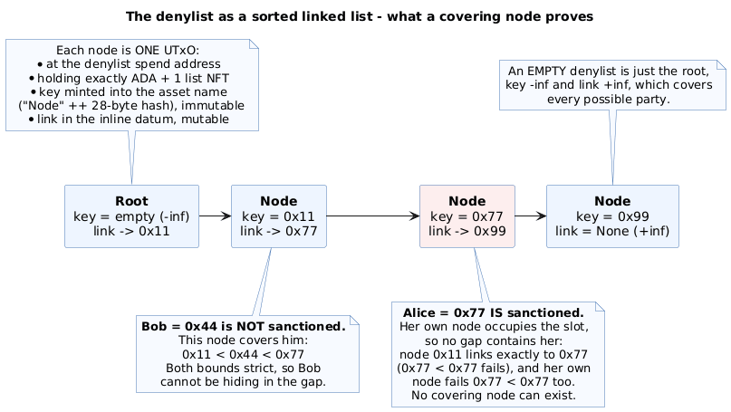
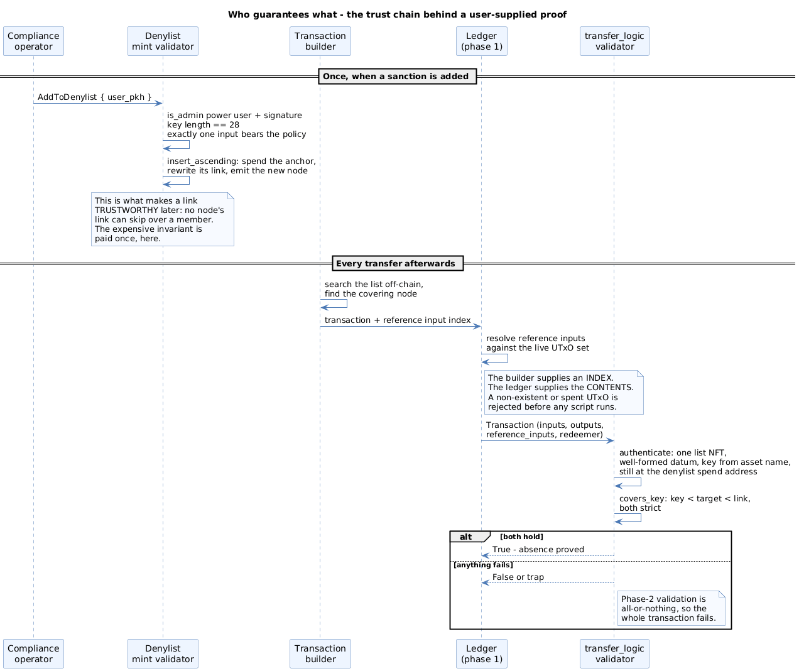
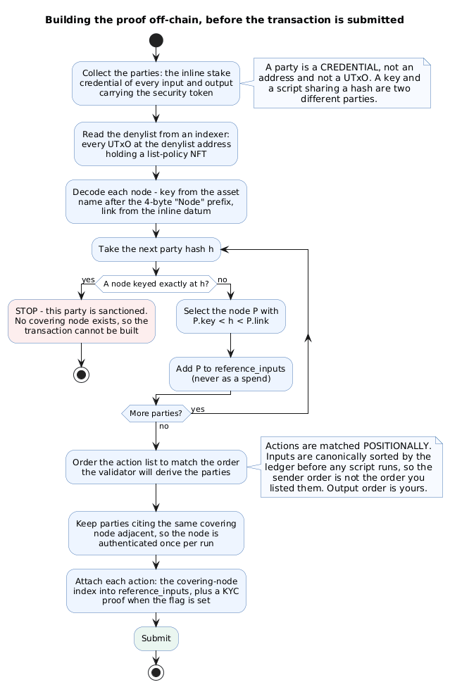
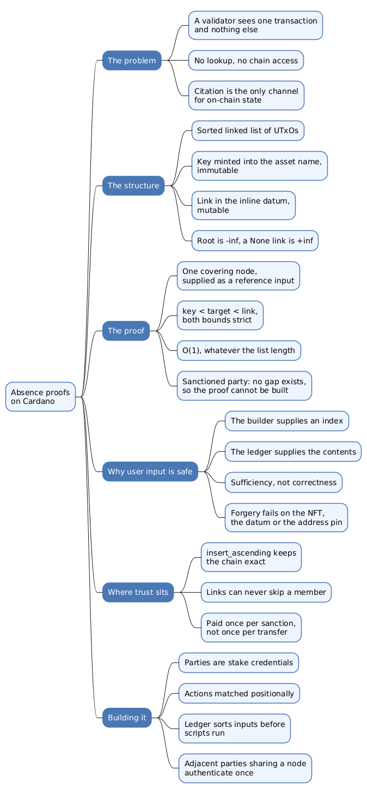

A permissioned token has to refuse a transfer when either party is under sanction. On an account-based chain that check is a lookup: the contract reads a mapping, finds the address or does not, and decides. On Cardano no such lookup exists. A Plutus script receives one transaction and nothing else, with no access to the ledger beyond what that transaction names, so "is this party on the denylist?" is not a question it can ask.

The Cardano implementations of the CMTAT security-token standard answer it the other way round. The party being vetted supplies a **proof of absence**, and the script checks it. That inversion invites an immediate objection: if the evidence comes from the person being checked, and the script has to validate the evidence anyway, what has been gained? The answer is that the script never establishes that the supplied evidence is the *right* evidence. It checks properties that make any evidence satisfying them sufficient, and the party's dishonesty has nowhere to express itself.

This article works through the mechanism as `cpt-rwa-ch-de-cmta-reference` implements it: the sorted linked list the denylist is built from, the covering-node proof, why a user-supplied reference input is not a trust hole, where the real invariant is established, and what a transaction builder has to do to satisfy it.

> This article has been made with the help of [Claude Code](https://claude.com/product/claude-code) and several custom skills

[TOC]

## A validator cannot look anything up

A Plutus script is a pure predicate over a single `Transaction`. It sees the inputs, the outputs, the mint field, the withdrawals, the signatories, the validity range, its own redeemer and datum. There is no opcode for reading the chain, no global state, and no way to enumerate the UTxO set.

So any on-chain fact a script needs must be brought to it by the transaction itself, as an input or a **reference input**, which is a UTxO the transaction reads without spending. Citation is the only channel. What looks like an unusual demand placed on the caller is really the only mechanism the ledger offers: if you want a script to know something about chain state, you must name the UTxO carrying it.

The consequence is that presence and absence are asymmetric. Proving a party *is* on a list is easy: cite their node. Proving they are *not* on it appears to require reading the whole list, which is exactly what a script cannot do.

## The denylist is a sorted linked list

The eUTXO model has no mapping type, so a set is built as an ordered chain of UTxOs. Each element is a **node**, and its key and its link behave very differently.



- **The key** is the sanctioned party's 28-byte credential hash. It is minted into the node's NFT asset name, after a four-byte `"Node"` prefix, so it is fixed at creation and cannot be rewritten.
- **The link** names the next key in ascending order. It lives in the inline datum, so whoever controls the UTxO can change it.

The root carries the empty key and acts as negative infinity; a link of `None` is the tail, positive infinity. An empty denylist is the root alone, whose bounds span every possible party.

That split between an immutable key and a mutable link is not an accident of implementation, and it explains a check that would otherwise look redundant. It is picked up again below.

## The covering node

Because the chain is sorted and each node names its immediate successor, a single node is a standing assertion: *my key is `k`, the next key is `n`, and there is nothing in between*.

That assertion is the proof. To show a party with hash `h` is absent, cite the node whose bounds bracket it. The check in `lib/denylist/absence.ak` is one comparison in each direction, with the sentinels treated as infinities:

```
covering_key < h  AND  h < covering_link
```

Both comparisons are **strict**, and that strictness is what makes the sanctioned case work. If a node keyed exactly at `h` exists, the node below it links precisely to `h`, so `h < link` fails on equality; the party's own node fails `key < h` for the same reason; and any node further down the chain links to its own successor, at or below `h`, failing the upper bound too. There is no fourth candidate. **A sanctioned party cannot construct the proof at all.** The transaction is not rejected so much as unbuildable, and the repository pins both equality edges with the tests `covers_target_equal_key_sad` and `covers_target_equal_link_sad`.

The cost is one reference input and two byte-string comparisons, whatever the length of the denylist.

## Why a user-supplied proof is not a trust hole

Return to the objection. The party being vetted chooses what the script looks at, so why is the check worth anything?

**Because what the builder supplies is a pointer, not data.** The redeemer carries an index into `reference_inputs`: a number. It carries no key, no link, and no claim about the denylist. The contents at that index come from the ledger: phase-1 validation resolves every reference input against the live UTxO set before any script executes, so a transaction naming a UTxO that does not exist, or that has been spent, is rejected before Plutus is reached. The builder chooses *which* UTxO the script reads. They cannot choose *what it contains*.

**And the script never decides whether this is the correct node.** It asks two questions: is this a genuine member of the list, and do its own bounds bracket the target? If both hold, absence follows regardless of which node it happens to be. At most one node in a sorted chain can satisfy the bracket for a given target, so locating it is the builder's problem, not a claim the script has to believe.

Every dishonest option fails against one of the checks.

| Attempt | What stops it |
|---|---|
| Cite a node that does not bracket the target | `covers_key` returns false |
| Fabricate a node with convenient key and link | Minting a list NFT requires a power user holding `is_admin` plus their signature |
| Move a genuine node NFT into a wallet and rewrite its link | The node must still sit at the denylist spend address |
| Cite a node belonging to a different list | The policy id is checked |
| Cite a bad index, or omit the reference input | The script traps |

The third row is where the immutable-key and mutable-link split earns its keep. Authenticating a node proves it is a real element; it says nothing about **where** that element sits. Since the key is pinned by the NFT but the link is not, a denylist NFT carried out of the list into a private wallet, keyed at the lowest possible value with its link set to `None`, would certify absence for every address on the chain. Requiring the node to still live at the list's own spend address is what makes "authenticated" mean "in the list".

Because phase-2 validation is all-or-nothing across every script purpose in a transaction, any one of these failures kills the whole transaction.

## Where the invariant is actually established

One thing the transfer-time check does not re-derive: that a node's link truthfully names its immediate successor. If a link could skip over a member, a valid-looking bracket would prove nothing, and the entire scheme would collapse.



That guarantee is written at insertion time instead. `AddToDenylist` does not append: it **spends the anchor node**, the existing predecessor, and re-outputs it with its link repointed at the new key, while the new node inherits the anchor's old link. `insert_ascending` enforces the ordering, and the validator additionally requires exactly one input bearing the list policy, so no second element can be restructured in the same transaction. Removal reverses the operation. Keys are length-checked at 28 bytes on the way in, because a key of any other length could never be the asset name of a real node and would silently lock the sanction out rather than being rejected.

The expensive work is therefore paid once, when a sanction is added, by an authorised compliance operator. Every transfer afterwards rides on that invariant in constant time. This is the general shape of verifiable computation: searching is expensive and happens off-chain, verifying is cheap and happens on-chain, and the verifier's soundness never depends on the prover's honesty.

## Constructing the proof

The on-chain half is two comparisons. The off-chain half is where integrations go wrong.



A builder works through four stages.

- **Identify the parties.** A party is a stake credential, not an address and not a UTxO. The validator folds the transaction, collecting the inline stake credential of every input carrying the security token, deduplicated with first occurrence winning, then does the same over the outputs for destinations. A verification key and a script sharing a hash count as two distinct parties.
- **Read and decode the list.** Query an indexer for every UTxO at the denylist address holding an NFT of the list policy, then recover each node's key from its asset name and its link from its inline datum.
- **Locate one covering node per party.** For a hash `h`, that is the last node whose key falls below `h`. Finding a node keyed exactly at `h` means the party is sanctioned and the transaction cannot proceed. Add each distinct covering node to `reference_inputs`, never as a spend.
- **Build the action list.** The redeemer carries one action per party, matched **positionally**, each naming its covering node's index and, where the corresponding flag is set, a KYC proof.

That last stage carries the trap. Actions are aligned with parties by position, so the list must be in the order the validator derives, and the ledger canonically sorts transaction inputs before any script runs. The sender order is therefore not the order the builder listed inputs in; it has to be computed from the sorted set. Output order, by contrast, is the builder's to choose.

The alignment fails closed. Supplying fewer actions than there are parties traps rather than silently skipping the unchecked ones, and actions beyond the last party are ignored, since every party is checked against the action at its own position.

## What the proof costs

Authenticating a covering node — re-reading the UTxO's value to find the NFT, re-parsing the datum, re-deriving the key from the asset name — dominates the per-party cost, and none of that work depends on the party being vetted.

The implementation memoises exactly one node. A party citing the index the previous party cited pays only the `covers_key` comparison; a party citing a different index re-authenticates, and that node becomes the remembered one. The optimisation applies to **adjacent runs**, not to any node seen earlier in the transaction, so parties sharing a covering node have to be consecutive in the action lists to benefit.

Measured against the shared CIP-113 execution budget, the difference is roughly 0.10 M memory per additional party sharing a node versus 0.15 M for one citing a fresh node, which sets the conservative ceiling at about 13 parties per side with denylist checks alone and about 9 with attestation KYC on both sides. With an empty denylist the question disappears: the root covers everyone, every party cites index 0, and the node is authenticated once for the entire transaction.

## Conclusion

The absence proof is a small mechanism carrying a large share of the compliance model. Its properties follow from three decisions that are worth separating.

Sorting the list turns non-membership into a local claim, checkable against one node instead of the whole set. Splitting the node between an NFT-minted key and a datum-held link makes forgery cheap to detect but requires the address pin, without which the scheme has a total bypass. And moving the ordering invariant to insertion time means the per-transfer check can be two comparisons, at the cost of a mint validator that must be exactly right.

The pattern generalises beyond sanctions lists. Any eUTXO application that needs to prove non-membership of a set (an allowlist, a registry, a nullifier set) faces the same absence problem and can use the same construction, and CIP-113's own registry uses it for precisely that reason.



## Annex

### Key Terms

| Term | Definition |
|------|------------|
| **Absence proof** | Evidence that a value is not in a set, supplied by the caller and checked locally by a validator that cannot enumerate the set itself. |
| **Covering node** | The list element whose own key and link strictly bracket a target hash, witnessing that the target is not present. |
| **Node** | One element of an on-chain linked list: a UTxO at the list's spend address holding exactly ADA plus one list NFT, its key in the NFT asset name and its link in the inline datum. |
| **Link** | The field naming the next key in ascending order. A link of `None` marks the tail and behaves as positive infinity. |
| **Root** | The list's first element, carrying the empty key and behaving as negative infinity. An empty list is the root alone. |
| **Reference input** | A UTxO a transaction reads without spending, and the mechanism by which any on-chain state reaches a script. |
| **Phase-1 validation** | The ledger-level checks that run before any script, including resolving every input and reference input against the live UTxO set. |
| **Phase-2 validation** | Script execution, which is all-or-nothing: if any script in the transaction fails, the whole transaction fails. |
| **Anchor node** | The existing predecessor spent and re-output with a rewritten link when a new key is inserted, which is what keeps the chain exact. |
| **Positional matching** | The redeemer convention pairing action *i* with party *i*, requiring the builder to reproduce the order the validator derives. |

### Invariants

| Invariant | Enforced by | Breaks if |
|---|---|---|
| The list is sorted ascending by key. | `insert_ascending` on every add and remove. | A node could be inserted out of order, so a bracket would no longer witness absence. |
| A node's link names its immediate successor, skipping nothing. | Insertion spends the anchor and rewrites its link; exactly one input may bear the list policy. | A link could span a sanctioned member, and a valid bracket would prove nothing. |
| A node's key cannot be altered after creation. | The key is minted into the NFT asset name. | A holder could re-key a node to bracket any target. |
| An authenticated node is genuinely in the list. | The address pin requiring the node to sit at the denylist spend address. | A node NFT held in a wallet, keyed low with a `None` link, would certify absence for every address. |
| Every key is exactly 28 bytes. | A length check on insertion. | A malformed key could never match a real node, leaving the sanction silently unenforceable. |
| Absence is proved for every party, or the transaction fails. | Lockstep walking of the party and action lists, which traps on a short action list. | A short redeemer would silently skip the unmatched parties. |

### Integration Notes

| Behaviour | What an integrator should do |
|---|---|
| A party is a stake credential, not an address. | Deduplicate by credential; treat a key and a script sharing a hash as two parties. |
| Inputs are canonically sorted by the ledger before scripts run. | Derive the sender order from the sorted input set, not from the order inputs were added. |
| Actions are matched positionally and fail closed on a short list. | Emit exactly one action per party, in the derived order; extra trailing actions are ignored but missing ones trap. |
| Only the immediately preceding covering node is memoised. | Group parties sharing a node consecutively, or pay full authentication for each. |
| The denylist is read, never spent. | Attach covering nodes as reference inputs; many transactions may cite the same node in one block without contention. |
| A sanctioned party makes the transaction unbuildable. | Detect this while building and surface it as a compliance refusal, rather than submitting and reading a script failure. |

## Frequently Asked Questions

**Q: Why can a Plutus script not simply look up the denylist?**

Because it has no access to the chain. A validator is a pure predicate over one `Transaction` and receives nothing else: no global state, no way to enumerate the UTxO set, and no way to query an address. Any on-chain fact must be brought to it by the transaction naming the UTxO that carries it, which is what a reference input is.

**Q: If the party being checked supplies the proof, what stops them supplying a favourable one?**

Nothing stops them trying, and it does not help. The redeemer carries an index into `reference_inputs`, not the node's contents, and the ledger resolves that index against the live UTxO set before any script runs. The builder therefore chooses which UTxO the script reads but not what it contains, and every wrong choice fails one of the checks: a node that does not bracket the target, one carrying no list NFT, one that has left the denylist address, or an index that does not resolve.

**Q: How does one node prove that a hash is absent from the whole list?**

Because the list is sorted and every node names its immediate successor, a node is an assertion that nothing exists between its own key and its link. If the target falls strictly inside that gap, it cannot be in the list. The proof is local, so it costs the same whether the denylist holds three entries or three thousand.

**Q: Why are both comparisons strict rather than inclusive?**

Strictness is what makes a sanctioned party unprovable. If the bounds were inclusive, the node keyed exactly at the target would satisfy its own bracket and certify the absence of a party that is present. With strict bounds the party's own node fails the lower comparison, its predecessor's link fails the upper one, and no other node can span the gap.

**Q: What actually makes a node's link trustworthy?**

The mint validator, at insertion time rather than at transfer time. Adding a sanction spends the existing predecessor and re-outputs it with its link repointed at the new key, so the chain stays exact and no link can skip a member. The check performed on every transfer relies on that invariant instead of re-deriving it, which is what keeps the per-transfer cost at two comparisons.

**Q: What is the practical failure mode when integrating this?**

Ordering. Actions are matched to parties positionally, and the ledger canonically sorts transaction inputs before scripts run, so the sender order is not the order the builder listed inputs in. Compute the order from the sorted input set. The secondary one is cost: only the immediately preceding covering node is memoised, so parties sharing a node must be adjacent to avoid paying full authentication each time.

## References

### Analyzed source

- [cardano-foundation/cpt-rwa-ch-de-cmta-reference](https://github.com/cardano-foundation/cpt-rwa-ch-de-cmta-reference) — analyzed at commit [`ff5624e4a01942bbb14aa1830110d93092819988`](https://github.com/cardano-foundation/cpt-rwa-ch-de-cmta-reference/tree/ff5624e4a01942bbb14aa1830110d93092819988), 2026-08-31. No release tag points at this commit. The mechanism described here lives in `lib/denylist/absence.ak`, `lib/compliance.ak` and `validators/denylist.ak`.

### Specifications and standards

- [CIP-113 — Programmable Tokens](https://github.com/HarmonicLabs/CIPs/blob/master/CIP-0113/README.md)
- [CIP-68 — Datum Metadata Standard](https://cips.cardano.org/cip/CIP-0068)
- [CMTAT — CMTA Token framework](https://github.com/CMTA/CMTAT)

### Tooling and ecosystem

- [Aiken smart-contract language](https://aiken-lang.org/)
- [Anastasia Labs Aiken design patterns](https://github.com/Anastasia-Labs/aiken-design-patterns)
- [Cardano Developer Portal](https://developers.cardano.org/)
- [Claude Code](https://claude.com/product/claude-code)

### Related documents in this repository

- [Equivalency assessment of `cpt-rwa-ch-de-cmta-reference`](./README-cpt-rwa-ch-de-cmta-reference.md)
- [What the successor codebase changed](./2026-08-26-cardano-cmta-swiss-german-profiles.md)
- [How the CIP-113 substandard reconstructs CMTAT on eUTXO](./2026-07-17-cmtat-cardano-cip113.md)
